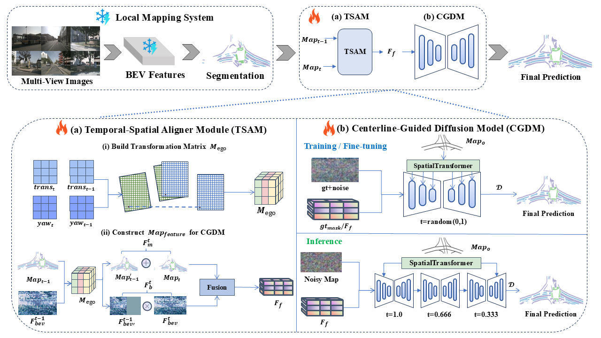
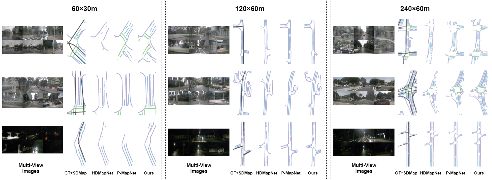

<p align="center">

  <h1 align="center">TS-CGNet: Temporal-Spatial Fusion Meets Centerline-Guided Diffusion for BEV Mapping</h1>
  <p align="center">
    <strong>Xinying Hong</strong>
    ·
    <strong>Siyu Li</strong>
    ·
    <strong>Kang Zeng</strong>
    ·
    <strong>Hao Shi</strong>
    ·
    <strong>Bomin Peng</strong>
    ·
    <strong>Kailun Yang</strong>
    ·
    <strong>Zhiyong Li</strong>
</p>

<h2 align="center"></h2>
  <div align="center">
    
  </div>


<p align="center" style="display: flex; justify-content: center; align-items: center; gap: 10px">
    <a href="https://pytorch.org/get-started/locally/">
        
    </a>
    <a href="">
        
    </a>
</p>

**Abstract**: Bird's Eye View (BEV) perception technology is crucial for autonomous driving, as it generates top-down 2D maps for
environment perception, navigation, and decision-making.
Nevertheless, the majority of current BEV map generation studies focusing on visual map generation lack depth-aware
reasoning capabilities.
They exhibit limited efficacy in managing occlusions and handling complex environments, with a notable decline in
perceptual performance under adverse weather conditions or low-light scenarios.
Therefore, this paper proposes TS-CGNet, which leverages Temporal-Spatial fusion with Centerline-Guided diffusion. This
visual framework, grounded in prior knowledge, is designed for integration into any existing network for building BEV
maps.
Specifically, this framework is decoupled into three parts:
Local mapping system involves the initial generation of semantic maps using purely visual information;
The Temporal-Spatial Aligner Module (TSAM) integrates historical information into mapping generation by applying
transformation matrices;
The Centerline-Guided Diffusion Model (CGDM) is a prediction module based on the diffusion model. CGDM incorporates
centerline information through spatial-attention mechanisms to enhance semantic segmentation reconstruction.
We construct BEV semantic segmentation maps by our methods on the public nuScenes and the robustness benchmarks under
various corruptions.
Our method improves 1.90%, 1.73%, and 2.87% for perceived ranges of 60×30m, 120×60m,
and 240×60m in the task of BEV HD mapping. TS-CGNet attains an improvement of 1.92% for perceived ranges
of 100×100m in the task of BEV semantic mapping. Moreover, TS-CGNet achieves an average improvement of 2.92%
in detection accuracy under varying weather conditions and sensor interferences in the perception range of
240×60m.

# Qualitative Results

Here is a demonstration of the qualitative results in various perceived ranges:

<div align="center">
  
</div>

# TODO

- [ ] Release the code.
- [x] Release the [arxiv preprint](https://arxiv.org/pdf/2503.02578).

<br>

# Citation

If our work is helpful to you, please consider citing us by using the following BibTeX entry:

```
@misc{hong2025tscgnettemporalspatialfusionmeets,
      title={TS-CGNet: Temporal-Spatial Fusion Meets Centerline-Guided Diffusion for BEV Mapping}, 
      author={Xinying Hong and Siyu Li and Kang Zeng and Hao Shi and Bomin Peng and Kailun Yang and Zhiyong Li},
      year={2025},
      eprint={2503.02578},
      archivePrefix={arXiv},
      primaryClass={cs.CV},
      url={https://arxiv.org/abs/2503.02578}, 
}
```